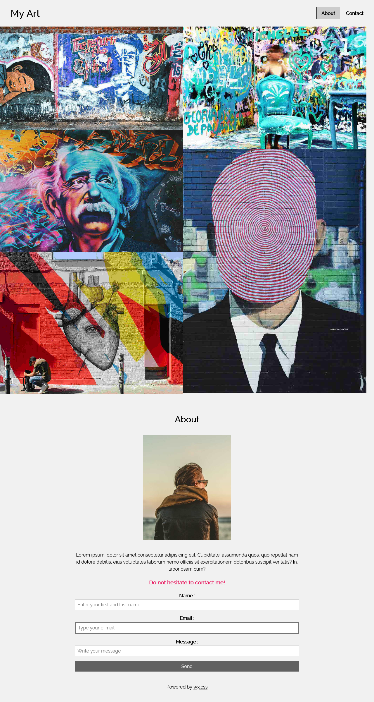

## Desenvolvendo template de layout grid

>  Site desenvolvido para estudos e práticas de HTML e CSS

 

### Tecnologias utilizadas:

* HTML5
* CSS3
* [GoogleFonts](https://fonts.google.com/)
* [NormalizeCSS](https://necolas.github.io/normalize.css/)

[Acesse o site clicando aqui](https://theslladev.github.io/My-Art/)